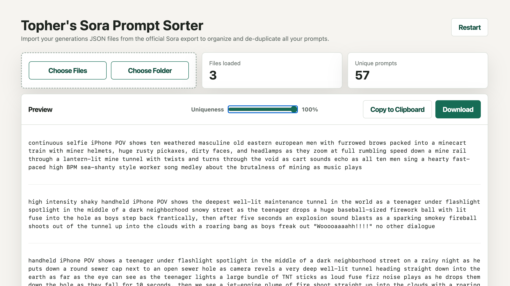

# Topher's Sora Prompt Sorter

Topher's Sora Prompt Sorter is a simple, 100% local tool for importing multiple generations JSON files from the official Sora export, extracting the prompts, sorting them by generation ID, and organizing them into a clean spreadsheet-ready file. Drop in or select as many export files as you want, and the tool will de-duplicate similar prompts using word shingling plus corpus-weighted token similarity with an adjustable uniqueness slider. The preview keeps prompt formatting readable, while the Copy to Clipboard and Download buttons include full details including `Order`, `ID`, `Prompt`, `Width`, and `Height`.

